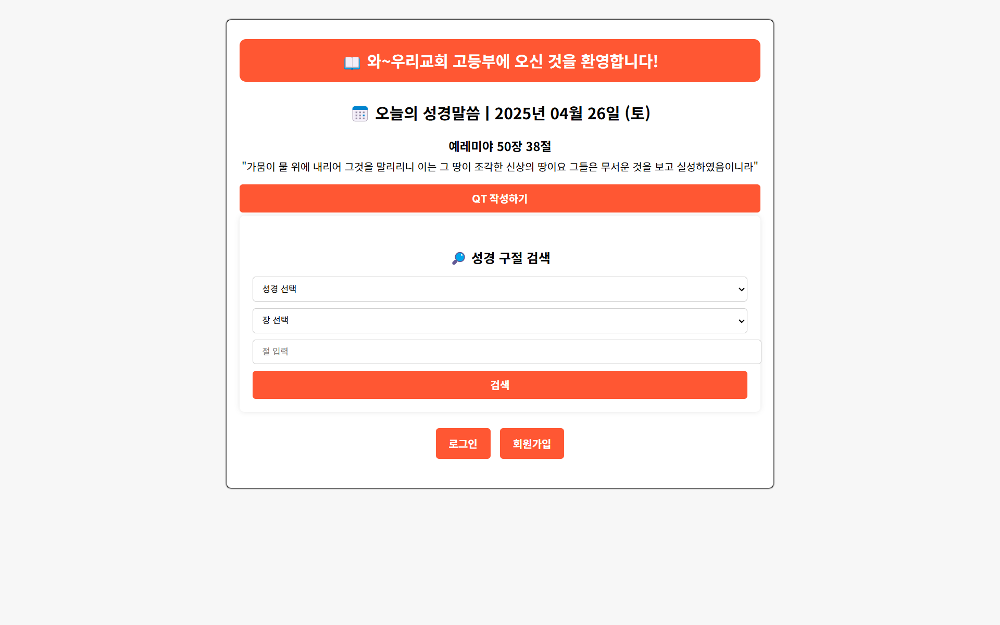

# 📖 BIBLE QT SITE

---

## 🌐 BIBLE QT SITE

### 📌 소개
- 교회 고등부 학생들을 위한 QT(Quiet Time) 작성 및 성경 구절 검색 시스템입니다.

---

### 🔧 사용 기술
- HTML5, CSS3
- JavaScript
- PHP
- MySQL

---

## 🛠️ 주요 파일 구조

- **메인 페이지**: `index.php`
- **로그인/회원가입 페이지**: `login/`, `register/`
- **QT 작성/저장**: `qt_write.php`, `save_qt.php`
- **성경 구절 검색 기능**: `search.php`
- **관리자 페이지**: `admin.php`
- **초기 데이터베이스 스크립트**: `q.sql`

---

## 🌐 데이터베이스 구조

#### SQL 정보
- **서버버전**: `10.4.32-MariaDB`
- **데이터베이스명**: `q`

#### 테이블
- **유저로그**: `user_logs`
- **유저큐티저장**: `user_qt`
- **유저정보**: `users`
- **오늘의 말씀**: `daily_verse`
- **성경말씀(개역개정)**: `bible2`
- **유저차단**: `banned_users`

#### 초기 관리자계정 정보
- **ID**: `admin`
- **P/W**: **admin1234**

---

## 📥 설치 방법

1. PHP 서버(XAMPP 등)에서 `/htdocs` 폴더에 파일을 업로드합니다.
2. MySQL 데이터베이스에 `q`라는 DB를 생성하고, `bible2.sql` 파일을 import하여 초기 데이터를 구성합니다.
3. 브라우저에서 `index.php`에 접속하여 실행합니다.

---

## 📌 주요 기능

- 회원가입 및 로그인 기능
- 매일 "오늘의 성경 말씀" 자동 표시
- 성경 구절 검색 기능 (책/장/절 선택)
- QT(묵상) 작성 및 저장 기능
- 관리자 전용 기능 (회원 관리, 차단, 관리자 권한 부여 등)

---

## 🚀 향후 업데이트 예정

- QT 작성글 수정/삭제 기능 추가
- ID 연동 로그인 기능 추가
- 관리자 페이지 기능 확장 (로그 및 통계 기능 추가)

---

## 📜 라이선스

MIT License를 적용합니다.  
자유롭게 사용, 수정 및 배포할 수 있습니다.

---

## 🖼️ 사이트 화면 예시

> 현재 사이트 메인화면은 다음과 같습니다:

※ 사용자는 "오늘의 성경말씀", "QT 작성", "성경 구절 검색"을 직관적으로 이용할 수 있습니다.
